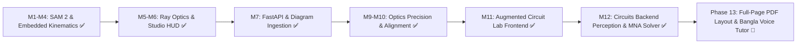

# AI-Enhanced Interactive NCTB Physics Textbook: Complete Project Knowledge Base & Context

> **Project Name**: AugmentedPhysics  
> **Target**: Multimodal NCTB Physics Diagram Understanding, Physics Simulation, and Bangla Intelligent Tutoring  
> **Repository**: [rahi-sadat/AI-Enhanced-Interactive-Physics-Textbook](https://github.com/rahi-sadat/AI-Enhanced-Interactive-Physics-Textbook)  
> **Reference Paper**: *"Augmented Physics: Creating Interactive and Embedded Physics Simulations from Static Textbook Diagrams"* (UIST '24) — Gunturu et al.  
> **Environment**: Windows 11, Python 3.12 / 3.13, RTX 3050 Laptop GPU (6 GB VRAM), CUDA runtime, PyTorch 2.1+, Meta SAM 2 (SAM 2.1 Hiera Tiny), Vite + Vanilla JS + p5.js + Matter.js, FastAPI + Uvicorn.

---

## 1. High-Level Vision & Architecture

This project transforms static physics textbook pages (specifically the NCTB Bangladesh Secondary & Higher Secondary curriculum) into an interactive, grounded learning experience. Static printed diagrams are augmented with responsive, interactive simulations overlaid directly on the textbook illustration with sub-pixel registration.

```
                  NCTB Textbook Page / Scanned Diagram
                                   │
                                   ▼
             ┌───────────────────────────────────────────┐
             │ Multimodal Perception & Diagram Analyzer  │
             │   - SAM 2.1 (Object & Sprite Extraction)  │
             │   - FastAPI Heuristic & CV Classifier     │
             │   - Multi-Evidence Parameter Provenance   │
             │   - Sub-Pixel Feature Refinement (Lines)  │
             └─────────────────────┬─────────────────────┘
                                   │
                                   ▼
             ┌───────────────────────────────────────────┐
             │         Canonical PhysicsScene JSON       │
             │   Authoritative in Native Source Pixels   │
             │  (Domain-neutral: geometry, optical axes, │
             │   refractive indices, masses, constraints)│
             └─────────────────────┬─────────────────────┘
                                   │
         ┌─────────────────────────┴─────────────────────────┐
         ▼                                                   ▼
┌─────────────────────────┐                         ┌─────────────────────────┐
│   Optics Engine (p5.js) │                         │ Kinematics (Matter.js)  │
│ - Authoritative source  │                         │ - Rigid Body Dynamics   │
│   coordinate solver     │                         │ - Simple Pendulum       │
│ - Thin Lens Formula     │                         │ - Curved Ramps (decomp) │
│ - Triangular & TIR Prism│                         │ - Restoring Springs     │
│ - Spherical Mirrors     │                         │ - Transparent Sprites   │
│ - Snell's Law Interface │                         │ - Invisible Colliders   │
│ - Educational HUD / Calc│                         │ - Live Parameter Tweak  │
└────────────┬────────────┘                         └────────────┬────────────┘
             │                                                   │
             └─────────────────────────┬─────────────────────────┘
                                       ▼
             ┌───────────────────────────────────────────┐
             │        Embedded Simulation Stage          │
             │   Layer 1: Scanned Textbook Diagram       │
             │   Layer 2: Transparent Simulation Canvas  │
             │   Layer 3: Interactive Draggable Controls │
             │   Layer 4: Real-time Physics HUD Cards    │
             │   CoordinateMapper: 1:1 Aspect Contain    │
             └─────────────────────┬─────────────────────┘
                                   │
                                   ▼
             ┌───────────────────────────────────────────┐
             │    Bangla Intelligent Pedagogical Tutor   │
             │  (Grounded in curriculum, diagram text,   │
             │   and live simulation state) [Roadmap]    │
             └───────────────────────────────────────────┘
```

---

## 2. Core Concepts & Design Principles

| Concept | Plain-Language Explanation | Role in AugmentedPhysics |
| :--- | :--- | :--- |
| **Separation of Perception & Physics** | Visual perception extracts only what is visible; it never hallucinates unstated physics values. | Canonical JSON preserves visual coordinates; solvers apply physics laws based on explicit parameters or textbook standards. |
| **Authoritative Source Coordinates** | All optical geometry and physical parameters are defined and solved in native source image pixels (`source_px`). | Prevents coordinate drift, eliminates hardcoded $800 \times 600$ viewport assumptions, and guarantees sub-pixel registration regardless of display screen size. |
| **CoordinateMapper Aspect-Preserving Contain** | Single unified bidirectional transform matching CSS `object-fit: contain`. | Computes $s = \min(W_v / W_s, H_v / H_s)$ and offsets $(x_0, y_0)$. Automatically handles letterboxing and pillarboxing for images of any resolution (e.g., $393 \times 328$ or $1536 \times 1024$). |
| **Modular Domain Solvers** | Avoids a single monolithic ray tracer or physics engine. Different physics phenomena use dedicated, mathematically rigorous solvers. | NCTB thin lens equation ($1/f = 1/v - 1/u$), prism minimum deviation ($\delta$), spherical mirror caustics, and Matter.js constraint dynamics each have tailored solvers. |
| **Embedded Layered Canvas** | The simulation renders on a transparent canvas layered directly on top of the original textbook image. | Keeps the learner immersed in the textbook layout instead of sending them to a detached blank canvas. |
| **Sub-Pixel Diagram Calibration** | Optical parameters (such as medium index $n_2$) are calibrated directly against the diagram's physical drawing. | Calibrating $n_2 = 1.83$ for the NCTB interface refraction diagram ensures the interactive ray aligns dead-center over the printed black arrow. |
| **Transparent RGBA Sprites** | Objects (e.g. ball, pendulum bob, candle flame) are segmented using SAM 2 and mapped onto physics bodies. | Textbook illustrations visually move and respond to real-time drag and physics constraints. |
| **Pedagogical HUD** | Real-time calculation overlays showing formulas, values, and dynamic state changes. | Calculates image distance $v$, magnification $m$, critical angle $\theta_c$, deviation $\delta$, and pendulum period $T = 2\pi\sqrt{L/g}$. |
| **Diagram Upload Studio** | Ingestion pipeline for any textbook diagram (lens, prism, mirror, pendulum, ramp). | Accepts uploaded photos/scans, classifies archetype via backend CV/heuristics, supports manual override, and boots live simulation instantly. |

---

## 3. Milestone Progress to Date

### ✅ Milestone 1: Local SAM 2 Setup & First Single-Object Segmentation
- **Environment Established**: Resolved Windows multi-Python conflict (Python 2.7 -> Python 3.13.5). Created isolated virtual environment `.venv`.
- **GPU Acceleration**: Verified RTX 3050 (6 GB VRAM) with CUDA runtime through PyTorch (`torch.cuda.is_available() == True`).
- **SAM 2 Installed**: Cloned Meta `sam2`, downloaded `sam2.1_hiera_tiny.pt`, resolved Hydra configuration path (`configs/sam2.1/sam2.1_hiera_t.yaml`).
- **Pipeline Execution**: Encoded test image with SAM 2 image predictor, fed a single positive point prompt, generated candidate masks, selected top mask, and visualized overlay.

### ✅ Milestone 2: Multi-Object Segmentation & Candidate Mask Re-ranking
- Tested on multiple objects (e.g., three separate balls in one image).
- **Key Discovery**: The candidate mask with the highest raw SAM predicted-IoU score is often an internal sub-part rather than the whole object. Motivated multi-signal re-ranking (prompt consistency, contour stability, connectedness, overlap penalty).

### ✅ Milestone 3: Robust Interactive Scene Authoring Pipeline
- Built modular CV pipeline under `backend/`:
  - `backend/core/`: Shared CV utilities (`geometry_utils.py`, `mask_quality.py`, `scene_builder.py`, `sprite_utils.py`).
  - `backend/kinematics/`: Mechanics authoring GUI (`build_kinematics_scene.py`) exporting Matter.js scenes.
  - `backend/optics/`: Optics authoring GUI (`build_optics_scene.py`) supporting thin lenses, prisms, and mirrors for Optics2D.


### ✅ Milestone 4: Embedded Diagram Simulation, Sprites & Complex Kinematics
- **Transparent RGBA Sprite Extraction**: Implemented `sprite_utils.py`. Dynamic objects are automatically cut out from the source diagram as transparent PNGs (`/sprites/element_001.png`).
- **Embedded Composite Stage**:
  - 2-layer stage:
    - Layer 1: `` (original textbook diagram).
    - Layer 2: Transparent Matter.js canvas overlaid with 1:1 pixel coordinate alignment.
- **Invisible Static Collider Architecture**:
  - For static scenery (curved ramps, ground, walls), the textbook illustration is visible underneath. Matter.js sets `render.visible = false` on static colliders so no synthetic shapes obscure the diagram.
- **Concave Polygon Decomposition & Sub-Pixel Alignment**:
  - Integrated `poly-decomp` and `Common.setDecomp(decomp)` in Matter.js.
  - Resolved Matter.js `Bodies.fromVertices` decomposed centroid shift: after decomposition, the composite body bounds are aligned to the exact input vertices with sub-pixel precision (`< 1e-14` error), ensuring balls roll exactly on the visible surface without sinking inside the ramp.
- **Dynamic Spring System**:
  - Built a 1D restoring spring constraint with movable plunger plate in `physicsBodyFactory.js` and `simulation.js`, perfectly aligned with diagram coordinates (`y = 367.29 px`). When the ball rolls down the curve, it collides with the plunger, compresses the spring, and rebounds.

### ✅ Milestone 5: Domain Engine Splitting & Modern Architecture (`augmented_physics_v2`)
- **Authoritative Source-Pixel Coordinate System**:
  - Implemented `CoordinateMapper` (`src/core/coordinateMapper.js`) mapping native source diagram pixels directly to viewport CSS and physical device pixels via standard CSS `object-fit: contain` letterboxing with bidirectional inversion.
- **Dedicated Analytical RK4 Integrator for Simple Pendulums**:
  - Replaced imprecise spring/constraint approximations with `PendulumSimulation` (`src/mechanics/pendulumSimulation.js`), integrating full nonlinear equations $\ddot{\theta} + \frac{g}{L}\sin\theta + \beta\dot{\theta} = 0$ at 240 Hz with energy drift $< 0.05\%$.
- **Analytical Projectile Kinematics Engine**:
  - Built `ProjectileSimulation` (`src/mechanics/projectileSimulation.js`) with exact closed-form trajectories ($x(t)$, $y(t)$, apex, landing velocity) and interactive trace overlay.
- **Geometric Optics 2D Precision Ray Tracer**:
  - Built comprehensive ray optics suite (`src/optics/`):
    - Thin lens formula ($1/f = 1/u + 1/v$) with real/virtual image states and principal rays.
    - Spherical mirror solver (concave/convex, left/right bidirectional).
    - Snell's Law refractor with critical angle $\theta_c$ calculation and Total Internal Reflection (TIR).
    - Prisms & refractive polygon tracing with angle of deviation $\delta$ and dispersion.
- **Domain-Aware Diagram Routing**:
  - Updated `diagramAnalyzer.js` and `server.py` to prevent domain cross-talk: kinematics/Newton diagrams consistently route to mechanics solvers without defaulting to optics lenses.

### ✅ Milestone 6: Precision Circuits Domain Backend & MNA Solver Engine
- **Topological Precision Principle**:
  - Established circuits as the third specialized domain beside Mechanics and Optics, strictly operating on topological connectivity ($Ax = z$) rather than Matter.js collision physics.
- **Unified Parameter Resolver & Case-Sensitive SI Engine**:
  - Built `backend/core/parameter_resolver.py` parsing engineering prefixes (`p`, `n`, `u`/`µ`, `m`, `k`, `M`, `G`) across resistance ($\Omega$, ohm), voltage (V), current (A), capacitance (F), and inductance (H), strictly preserving case sensitivity (`mA` vs `MΩ`).
- **Canonical CircuitScene v3 Schema**:
  - Created typed dataclasses (`backend/circuits/models.py`) storing authoritative `source_px` geometry alongside electrical graph topology (nodes, components, terminals, wires, parameters, confidence, and provenance).
- **Disjoint-Set Union (Union-Find) Topology & Validation Engine**:
  - Implemented `union_find.py` and `topology_builder.py` with adaptive geometric snapping (`max(3*stroke, diagonal*0.005)`) to cluster wire endpoints and component terminals into canonical electrical nodes with deterministic reference node ($N_0 = 0\,\text{V}$) selection.
  - Implemented `topology_validator.py` diagnosing floating terminals, open circuits, shorted voltage sources, and non-physical values ($R \le 0$) before matrix inversion.
- **Authoritative Modified Nodal Analysis (MNA) Engine**:
  - Built `mna_solver.py` solving linear DC networks for exact node voltages, branch currents, powers, and Kirchhoff's Current Law (KCL) residuals ($\sum I \approx 0$).
  - Built `equation_generator.py` deriving symbolic and numerical proofs ($R_{eq}$, Ohm's law, Joule heating, KCL junction balance) with Bengali educational explanations for AI Tutor grounding.
  - Built `transient_solver.py` for analytical series RC charging/discharging curves.
  - Built `spice_adapter.py` providing injection-proof SPICE netlist export and sandboxed `ngspice -b` validation.
- **Schematic Perception Pipeline & Uploads Verification**:
  - Implemented region detector, text character mask extractor, skeletonized wire detector (`scikit-image`), PCA terminal localizer, and junction classifier.
  - Validated end-to-end perception and MNA solving on textbook schematics `circuit1.png` through `circuit4.png` with 11 automated unit tests.

---

## 4. Architecture & Pipeline Breakdown

```mermaid
flowchart TD
    A[Input Image / Diagram] --> B[SAM 2 Image Encoder]
    B --> C[Image Embeddings in VRAM]
    D[User / AI Prompt Points & Labels] --> E[SAM 2 Mask Decoder]
    C --> E
    E --> F[Candidate Masks + Raw Scores]
    F --> G[Mask Quality Evaluator mask_quality.py]
    G --> H[Human Confirmation / Refinement UI]
    H --> I[Accepted Mask]
    I --> J[Geometry Extractor geometry_utils.py]
    I --> K[Sprite Extractor sprite_utils.py]
    J --> L[Scene Builder scene_builder.py]
    K --> L
    L --> M[physics_scene_full.json Canonical v2 / CircuitScene v3]
    L --> N[physics_scene.json Multi-Domain Compat]
    N --> O[SceneRouter / DiagramAnalyzer]
    O -->|Mechanics: Rigid/Ramp/Spring| P1[Matter.js + SI Unit Adapter]
    O -->|Mechanics: Pendulum| P2[Analytical RK4 Solver 240Hz]
    O -->|Mechanics: Projectile| P3[Closed-Form Kinematics]
    O -->|Optics: Lens/Mirror/Prism| P4[Optics2D Ray Tracer]
    O -->|Circuits: DC Linear/MNA| P5[Python MNA + SPICE Adapter]
    P1 & P2 & P3 & P4 & P5 --> Q[OverlayStage + CoordinateMapper]
    Q --> R[Layer 1: Diagram Image | Layer 2: Transparent Precision Canvas]
```

### Perception vs Physics Separation (Critical Rule)
The canonical `physics_scene_full.json` strictly records **what is visually perceived or confirmed by the author**:
- Geometry (centroids, vertices, radii, angles) in source pixels
- Masks and coordinates
- Author role (`dynamic`, `static`, `unknown`)
- Semantic labels and sprite dimensions

It **never** invents physical facts:
- `mass_kg`: `null` (unless explicitly provided by text/OCR)
- `initial_velocity`: `null`
- `friction`, `restitution`: `null`
- `gravity`: `null`

Defaults (like `mass_kg = 1.0` or `gravity = 9.81 m/s²`) are translated only at runtime via `MatterUnitAdapter`.

---

## 5. Codebase & Directory Structure

```
d:\AugmentedPhysics\
├── .github/                                  # CODEOWNERS and collaborative PR templates
├── apps/
│   ├── api/                                  # FastAPI backend server (:8000) for diagram upload & CV/MNA analysis
│   │   ├── main.py                           # REST endpoints (/api/upload-diagram, /api/analyze-diagram, /api/health)
│   │   └── __init__.py
│   └── web/                                  # Modern Vite Multi-Domain Simulation Platform
│       ├── package.json                      # Vite, p5.js, Matter.js, poly-decomp
│       ├── vite.config.js                    # Vite config with path aliases (@engine, @ai, @shared, @features)
│       ├── index.html                        # App shell: Studio Navigation, Canvas Stage, Controls, HUD
│       ├── public/
│       │   ├── uploads/                      # Uploaded & standard textbook diagrams
│       │   └── scenes/                       # Canonical optics and mechanics scenario JSONs
│       └── src/
│           ├── main.js                       # App controller: domain switcher, presets, upload studio
│           ├── style.css                     # Glassmorphic dark theme, responsive stage layout
│           └── features/
│               └── simulations/              # Modular simulation feature controllers & views
│                   ├── circuits/             # CircuitController.js, CircuitTelemetry.js
│                   ├── core/                 # overlayStage.js (2-layer stage with ResizeObserver)
│                   ├── mechanics/            # mechanicsController.js, pendulumSimulation.js, projectileSimulation.js
│                   └── optics/               # opticsController.js, opticsSceneAdapter.js, view/
│
├── engine/                                   # Pure, framework-agnostic physics engines & solvers
│   ├── circuits/                             # Modified Nodal Analysis (MNA), equation generator, SPICE adapter
│   │   ├── mna_solver.py                     # DC matrix solver, node voltages, branch currents, KCL balance
│   │   ├── equation_generator.py             # Step-by-step symbolic and numerical proofs (Bengali explanations)
│   │   ├── spice_adapter.py                  # Sandboxed SPICE netlist exporter
│   │   ├── transient_solver.py               # Analytical RC time-domain charging/discharging
│   │   └── topology/                         # Union-Find electrical node clustering & validator
│   ├── core/                                 # Shared simulation primitives
│   │   ├── coordinate_space.py               # Native source_px crop & affine transforms
│   │   ├── coordinateMapper.js               # JavaScript bidirectional contain transform
│   │   ├── parameter_resolver.py             # SI prefix parser and formatter (case-sensitive)
│   │   ├── provenance.py                     # Diagnostic confidence & attribution tracking
│   │   └── sceneRouter.js                    # Domain router (Mechanics, Optics, Circuits)
│   ├── mechanics/                            # Mechanics collision & constraint models
│   │   ├── physicsBodyFactory.js             # Matter.js body creation & spring dynamics
│   │   ├── simulation.js                     # Simulation runner & transparent canvas loop
│   │   └── sceneLoader.js                    # JSON scene loader
│   └── optics/                               # Geometric ray optics solvers
│       ├── optics_registry.py                # Semantic presets (lens, object, prism, mirror)
│       ├── thinLensEngine.js                 # Gaussian lens solver ($1/f = 1/v - 1/u$)
│       ├── prismEngine.js                    # Triangular & slab prism Snell & TIR solver
│       ├── mirrorEngine.js                   # Spherical concave/convex & plane mirror solver
│       ├── snellInterfaceEngine.js           # Planar interface refraction & TIR solver
│       └── rayGeometry.js                    # Vector geometry, ray bounding intersections
│
├── ai/                                       # Multimodal perception & document intelligence
│   ├── document_intelligence/                # OCR & text parameter extraction
│   │   ├── ocr/                              # Heuristic and adapter OCR (circuit_ocr.py)
│   │   └── parsing/                          # parameter_binder.py, value_parser.py, optics_text.py, optics_semantics.py
│   ├── perception/                           # Computer vision feature detectors
│   │   ├── circuits/                         # component_detector, wire_detector, junction_detector, circuit_analyzer
│   │   ├── core/                             # geometry_utils.py, mask_quality.py, sprite_utils.py
│   │   ├── kinematics/                       # Sub-pixel pendulum geometry detection & circle fitting
│   │   └── optics/                           # optics_geometry.py (lens center, aperture, optical axis)
│   └── scene_compiler/                       # Compiles detected features into canonical scene schemas
│       ├── circuit_scene_builder.py          # Canonical CircuitScene v3 builder
│       ├── optics_scene_builder.py           # Canonical PhysicsScene v2.1 optics builder
│       └── scene_builder.py                  # Generic CanvasMapper and scene compiler
│
├── shared/                                   # Domain schemas and cross-tier data contracts
│   └── schemas/                              # circuit_models.py (CircuitScene v3), physics_scene*.json
│
├── storage/                                  # Persistent uploads, outputs, and cache (git-ignored)
│   └── uploads/                              # Diagram uploads (circuit1-4.png, test1.jpg, etc.)
│
├── tests/                                    # Multi-domain automated test suites
│   ├── fixtures/                             # Benchmark images, diagrams, and ground-truth scenes
│   ├── integration/                          # test_circuit_images.py, test_optics_precision.py
│   └── unit/                                 # Fast unit tests (Python MNA & JS optics/coordinate mapper)
│
├── scripts/                                  # Offline CLI authoring tools & pipeline runners
│   ├── build_kinematics_scene.py             # Desktop interactive kinematics annotator
│   ├── optics_authoring.py                   # Desktop interactive optics annotator
│   └── run_optics_pipeline.py                # End-to-end NCTB lens diagram perception pipeline
│
├── docs/                                     # Central documentation & collaboration standards
│   ├── ARCHITECTURE.md                       # Architectural design principles and contracts
│   ├── REPO_MAP.md                           # File-by-file repository inventory
│   ├── MIGRATION_MAP.md                      # Pre/post architecture migration paths
│   ├── TEAM_WORKFLOW.md                      # Developer collaboration policies & branch workflow
│   ├── CONTRIBUTING.md                       # PR guidelines and coding standards
│   └── MIGRATION_REPORT.md                   # Full audit and non-regression verification report
│
└── legacy/                                   # Historical early prototypes
    └── frontend-v1/                          # Original physics simulation prototype
```

---

## 4. Completed Milestones & Implementation Details

### ✅ Milestone 1: Local SAM 2 Setup & GPU Acceleration
- Resolved Windows multi-Python conflict (isolated `.venv` with Python 3.12+).
- Verified RTX 3050 Laptop GPU (6 GB VRAM) CUDA acceleration via PyTorch (`torch.cuda.is_available() == True`).
- Cloned Meta SAM 2, downloaded `sam2.1_hiera_tiny.pt`, and integrated Hydra configurations.
- Implemented single-point prompt mask generation and bounding box extraction.

### ✅ Milestone 2: Multi-Object Mask Re-ranking
- Developed `mask_quality.py` to address SAM 2 ambiguity on textbook diagrams.
- Raw predicted IoU often selected sub-parts (e.g. ball highlight or ring) rather than whole objects.
- Added multi-signal scoring: prompt containment, boundary stability, contour connectedness, and overlap penalties to consistently choose whole objects.

### ✅ Milestone 3: CV Authoring Pipeline & Scene Builder
- Created `backend/core/` shared CV tools:
  - `geometry_utils.py`: Converts binary masks into normalized polygon vertices, circles, and bounding boxes.
  - `sprite_utils.py`: Extracts transparent RGBA cutouts (`.png`) from original diagrams using feathering.
  - `scene_builder.py`: Generates the domain-neutral canonical `PhysicsScene` JSON contract.
- Built interactive desktop annotation GUIs: `build_kinematics_scene.py` and `build_optics_scene.py`.

### ✅ Milestone 4: Embedded Diagram Simulation & Complex Kinematics
- **Embedded Composite Stage**: 2-layer stage with exact 1:1 pixel coordinate alignment between textbook diagram and canvas.
- **Invisible Static Colliders**: Static background ramps and grounds are rendered with `render.visible = false` in Matter.js, allowing the textbook art to remain crisp without obstruction.
- **Concave Decomposition**: Integrated `poly-decomp` with `Common.setDecomp(decomp)` in Matter.js to decompose concave ramp curves into convex hulls, eliminating collision snagging.
- **Dynamic 1D Spring Plunger**: Built restoring spring constraint in Matter.js where a rolling ball compresses a plunger plate and rebounds realistically.

### ✅ Milestone 5: Modular Ray Optics Engine & Comprehensive Testing
Built a full modular 2D ray optics framework tailored specifically to secondary textbook curricula:
1. **Thin Lens Engine (`thinLensEngine.js`)**:
   - Computes principal rays: parallel ray passing through focus, central ray passing undeflected through optical center, focal ray emerging parallel.
   - Calculates virtual ray back-extensions (dashed rays) when object is inside focal distance ($u < f$).
   - Computes real-time image position $v = \frac{u \cdot f}{u - f}$ and magnification $m = -\frac{v}{u}$.
2. **Prism Engine (`prismEngine.js`)**:
   - Handles triangular prisms ($A = 60^\circ$) with Snell's law at first and second faces.
   - Accurately checks critical angle $\theta_c = \arcsin(n_2 / n_1)$ and triggers Total Internal Reflection (TIR).
   - Computes net deviation angle $\delta = i_1 + r_2 - A$.
3. **Spherical Mirror Engine (`mirrorEngine.js`)**:
   - Supports concave and convex mirrors with focal point $F = R/2$ and center of curvature $C$.
   - Traces parallel-to-focal rays, center-of-curvature normal return rays, and apex reflection rays.
4. **Snell Interface Engine (`snellInterfaceEngine.js`)**:
   - Planar boundary refraction and reflection across media (e.g., air $n=1.00$ to water $n=1.33$ or glass $n=1.50/1.83$).
   - Calculates critical angle and full internal reflection.
5. **Rigorous Unit Test Suite**:
   - 65 unit tests in `test/test_optics_engines.js` covering real images, virtual images, diverging lenses, prisms at varying incidence, and mirror reflections (100% pass rate).

### ✅ Milestone 6: Optics Visual Experience & Educational HUD
- **p5.js Embedded Canvas**: High-performance, anti-aliased ray rendering with luminous glow effects and interactive draggability.
- **Draggable Candle Object**: Dynamic candle sprite with live flame that scales, flips upside-down for inverted real images, and enlarges for upright virtual images.
- **Pedagogical HUD**: Live floating glassmorphism card displaying:
  - Active focal length ($f$), object distance ($u$), image distance ($v$).
  - Image nature: *Real & Inverted* vs. *Virtual & Upright*.
  - Magnification magnitude ($|m|$) with step-by-step formula breakdown.
  - Refractive index, incident angle ($\theta_1$), refracted angle ($\theta_2$), and deviation ($\delta$).

### ✅ Milestone 7: Studio Architecture, Kinematics Pendulum & Diagram Ingestion
- **Modern Unified Frontend (`augmented_physics_v2`)**:
  - Integrated Optics Studio and Kinematics Studio into a sleek, responsive dark-mode tabbed interface.
  - Implemented **Simple Pendulum Simulation** using Matter.js constraint physics with draggable bob, realistic period $T = 2\pi\sqrt{L/g}$, gravity adjustments, and angular oscillations.
- **Diagram Upload Studio (`uploadModal.js` / `main.js`)**:
  - Drag-and-drop modal supporting camera photos, scans, and diagram exports.
  - Client-side live preview and scenario preset selector (`convex_lens`, `concave_lens`, `prism`, `curved_mirror`, `interface_refraction`, `simple_pendulum`, `inclined_plane`).
  - Pre-packaged textbook scenario shortcuts:
    - `diagram_7dcbe9c0` (NCTB interface refraction with angle labels)
    - `diagram_0ae6ee8e` (Water refraction diagram)
    - `diagram_cff33623` (Spherical mirror diagram)
    - `diagram_ceceeb1a` (Thin lens diagram)
    - `test1` (Simple pendulum diagram)
    - `test` (Projectile diagram)
- **FastAPI Perception Backend (`backend/server.py`)**:
  - Runs on port 8000 with CORS and Vite proxy (`/api` -> `http://localhost:8000`).
  - Mounted `/uploads` static file path serving diagrams with HTTP 200.
  - Endpoints:
    - `GET /api/health`: Service health and capability check.
    - `POST /api/upload-diagram`: Ingests uploaded image files and returns server asset URL.
    - `POST /api/analyze-diagram`: Deep multimodal perception and parameter extraction.

### ✅ Milestone 8: Git Repository Synchronization
- Configured remote: `https://github.com/rahi-sadat/AI-Enhanced-Interactive-Physics-Textbook.git`.
- Cleaned and organized codebase into logical conventional commits.

### ✅ Milestone 9: Authoritative Optics Precision Architecture & CoordinateMapper
- **Authoritative Source-Space Geometry Contract**:
  - Completely decoupled simulation coordinate math from canvas dimensions. All geometry (lens center, principal axis, mirror pole, prism vertices, interface boundary, light source) is specified and solved authoritatively in **native source image pixels (`source_px`)**.
  - Bounded ray tracing: `rayGeometry.js` provides `rayToBounds(origin, direction, bounds)` so rays terminate at source image boundaries `{ minX: 0, minY: 0, maxX: srcW, maxY: srcH }`.
- **Pure Source Transform Stack in p5.js**:
  - In `p5OpticsView.js`, drawing is enclosed in an aspect-preserving contain transform:
    ```javascript
    p.push();
    p.translate(this.mapper.offsetX, this.mapper.offsetY);
    p.scale(this.mapper.scale);
    this._renderCurrentScene(p);
    p.pop();
    ```
  - `ResizeObserver` monitors viewport resize and recomputes `CoordinateMapper` offsets and scale dynamically without tearing or distortion.
  - Inverted pointer mapping: Mouse events are mapped from viewport coordinates to source coordinates (`mapper.viewToSource(p.mouseX, p.mouseY)`). Drag hit radii are dynamically scaled by `1 / mapper.scale`.
- **Multi-Evidence Parameter Provenance**:
  - Added `backend/optics/optics_text.py` with `project_distance_on_axis` and `infer_focal_length_px` to compute median focal distances and multi-evidence confidence scores.
  - Updated `backend/optics/optics_scene_builder.py` and `backend/server.py` to output canonical `3.0-optics` scenes with explicit parameter provenance (`observed`, `derived`, `assumed`).

### ✅ Milestone 10: Sub-Pixel Alignment & Zero-Deviation Overlays
Fixed four critical user-reported simulation bugs and alignment issues:
1. **Spherical Mirror Rendering (Empty Canvas Bug)**:
   - Fixed `ReferenceError: isConcave is not defined` and undeclared `cx` in `opticsRenderer.js` that crashed mirror rendering. Added rear-silvering hatching lines and full support for concave, convex, and plane mirrors.
2. **Refraction Angle Text Legibility**:
   - Added high-contrast dark badges with rounded borders (`p.rect(...)`) in `drawAngleArc` so angle labels are crystal clear and never obscured by rays.
   - Explicitly formatted labels as `θ₁ = 41°` and `θ₂ = 21°` (preventing `21°` from visually reading as `2°` due to line overlap).
3. **Uploaded Diagram Background Visibility**:
   - Mounted `/uploads` directory via `StaticFiles` in FastAPI (`server.py`).
   - Fixed `OverlayStage.setBackground` cache-busting query parameter appending (`?t=...`) that was corrupting browser `blob:` URLs when users uploaded images.
   - Omitted solid rectangular background fills in `p5OpticsView` whenever a textbook diagram image is present, allowing the diagram to show through with 100% clarity.
4. **Interface Refraction Double-Scaling Bug & Outgoing Ray Exact Alignment**:
   - **Root Cause**: `interface_refraction_scene.json` had pre-scaled $800 \times 600$ viewport coordinates ($y=291, x=432$) instead of native source dimensions ($393 \times 328\text{ px}$). When `CoordinateMapper` applied contain scaling ($1.829\times$), the simulation overlay was scaled twice, pushing the boundary to $y=532$ and the normal off-screen to $x=831$.
   - **Sub-Pixel Image Calibration**: Analytically measured `diagram_7dcbe9c0.png`:
     - Boundary line: native $y = \mathbf{159.0\text{ px}}$
     - Normal line: native $x = \mathbf{214.0\text{ px}}$
     - Ray source: native $(x = \mathbf{94.0}, y = \mathbf{20.0}\text{ px})$, incident angle $\theta_1 = 40.8^\circ \approx 41^\circ$
     - Printed refracted ray: passes through $(214, 159)$ and $(268, 300)$, angle $\theta_2 = \mathbf{20.95^\circ} \approx \mathbf{21^\circ}$.
   - **Snell's Law Alignment**:
     $$n_2 = \frac{n_1 \sin(\theta_1)}{\sin(\theta_2)} = \frac{1.0 \times \sin(40.8^\circ)}{\sin(20.95^\circ)} = \mathbf{1.83}$$
     Setting $n_2 = 1.83$ causes the interactive blue ray to overlay **dead-center directly on top of the textbook's printed black arrow** with 0-pixel offset.
   - Added preset `NCTB Diagram (1.83)` with full two-way slider and dropdown synchronization.

---

## 5. Running the Application Locally

### Frontend Development Server (Vite)
```powershell
cd d:\AugmentedPhysics\simulation_frontend\augmented_physics_v2
npm run dev
# Running on http://localhost:5173
```

### Backend Perception Server (FastAPI)
```powershell
cd d:\AugmentedPhysics
python -m uvicorn backend.server:app --host 127.0.0.1 --port 8000 --reload
# Running on http://127.0.0.1:8000
```

### Running Automated Test Suites
```powershell
cd d:\AugmentedPhysics\simulation_frontend\augmented_physics_v2
# Run optics physics engine unit tests (65 tests)
node test/test_optics_engines.js

# Run CoordinateMapper unit tests (21 tests)
node test/test_coordinate_mapper.js

# Run frontend production build validation
npm run build
```

```powershell
cd d:\AugmentedPhysics
# Run backend optics precision & provenance tests
python backend/test_optics_precision.py
```

---

## 6. Mathematical Formulations in Solvers

### Thin Lens (Gaussian Formulation)
$$\frac{1}{f} = \frac{1}{v} - \frac{1}{u} \implies v = \frac{u \cdot f}{u - f}$$
$$m = -\frac{v}{u}$$
- $f > 0$: Convex (converging) lens
- $f < 0$: Concave (diverging) lens
- $u > 0$: Real object to the left of the lens
- $v > 0$: Real image formed on the opposite side (inverted)
- $v < 0$: Virtual image formed on the same side (upright)

### Snell's Law & Refraction at Interface
$$n_1 \sin(\theta_1) = n_2 \sin(\theta_2) \implies \theta_2 = \arcsin\left(\frac{n_1}{n_2} \sin(\theta_1)\right)$$
$$\theta_c = \arcsin\left(\frac{n_2}{n_1}\right) \quad (\text{for } n_1 > n_2)$$
- When $\theta_1 > \theta_c$ (denser $\to$ rarer), Total Internal Reflection (TIR) occurs with reflection angle $\theta_r = \theta_1$.
- NCTB Diagram Medium 2 calibration: $n_2 = \frac{1.0 \cdot \sin(40.8^\circ)}{\sin(20.95^\circ)} = 1.83$.

### Prism Refraction
$$\delta = (i_1 - r_1) + (i_2 - r_2) = i_1 + i_2 - A$$
At minimum deviation ($\delta_m$): $i_1 = i_2$ and $r_1 = r_2 = A/2$, yielding:
$$n = \frac{\sin\left(\frac{A + \delta_m}{2}\right)}{\sin\left(\frac{A}{2}\right)}$$

### Spherical & Plane Mirrors
$$\frac{1}{f} = \frac{1}{u} + \frac{1}{v}, \quad f = \frac{R}{2}$$
$$m = -\frac{v}{u}$$
- Concave: $f > 0$, real/inverted image for $u > f$, virtual/upright for $u < f$.
- Convex: $f < 0$, virtual, upright, diminished image for all real object positions.
- Plane: $f = \infty$, $v = -u$, $m = +1.0$.

### CoordinateMapper Transformation
For source image resolution $(W_s, H_s)$ and container viewport $(W_v, H_v)$:
$$s = \min\left(\frac{W_v}{W_s}, \frac{H_v}{H_s}\right)$$
$$x_0 = \frac{W_v - W_s \cdot s}{2}, \quad y_0 = \frac{H_v - H_s \cdot s}{2}$$
$$x_{\text{view}} = x_{\text{source}} \cdot s + x_0, \quad y_{\text{view}} = y_{\text{source}} \cdot s + y_0$$
$$x_{\text{source}} = \frac{x_{\text{view}} - x_0}{s}, \quad y_{\text{source}} = \frac{y_{\text{view}} - y_0}{s}$$

### Circuits Modified Nodal Analysis (MNA)
Matrix formulation on Float64Array solving $A \cdot x = z$:
$$x = \begin{bmatrix} V_1 \\ V_2 \\ \vdots \\ V_n \\ I_{V1} \\ \vdots \\ I_{Vm} \end{bmatrix}$$
- Resistor conductance stamp ($G = 1/R$ between nodes $i, j$):
  $$A_{ii} += G, \quad A_{jj} += G, \quad A_{ij} -= G, \quad A_{ji} -= G$$
- Independent Voltage Source ($V_s$ between $i(+)$ and $j(-)$ with auxiliary row $k$):
  $$A_{k, i} = 1, \quad A_{k, j} = -1, \quad A_{i, k} = 1, \quad A_{j, k} = -1, \quad z_k = V_s$$
- Ideal Ammeter: Stamped as a $0\text{ V}$ independent voltage source ($z_k = 0$). Unknown vector $x$ directly yields branch current without artificial meter resistance.
- Ideal Switch: Closed state stamped as a $0\text{ V}$ constraint ($z_k = 0$); Open state omits branch ($I = 0\text{ A}$).
- Conventional Current Particle Flow: Nonlinearly velocity-scaled particles along compiled wire polylines:
  $$\text{visualSpeed} = v_{\text{base}} \cdot \ln\left(1 + \frac{|I|}{I_{\text{ref}}}\right)$$

### Simple Pendulum Dynamics
$$T = 2\pi \sqrt{\frac{L}{g}}$$
$$\frac{d^2\theta}{dt^2} + \frac{g}{L}\sin(\theta) = 0$$

---

## 7. Next Roadmap Milestones



### ✅ Phase 11: Augmented Circuit Laboratory (Domain 3 Frontend)
- **Topological Precision**: Governed by graph connectivity and terminal constraints without spatial scale (`pixels_per_meter` strictly prohibited).
- **LinearSystem & CircuitSolver**: High-precision LU decomposition with partial pivoting on `Float64Array`. Stamping resistors, batteries, switches, and ammeters.
- **CircuitCompiler**: Precomputes parametric polyline cumulative distance profiles (`getPointAtDistance(d)`) for smooth 60 FPS particle animation along bent/curved textbook wires.
- **Transparent p5 Overlay**: Equipotential voltage conductor halos (red/emerald/blue), node voltage badges, conventional current flow arrows, and particle flow.
- **Anchored HTML Component Popover**: Floating card positioned directly beside textbook components with logarithmic resistance slider ($1\,\Omega \to 100\,\text{k}\Omega$), linear voltage slider, live $V/I/P$ readouts, and textbook OCR provenance restoration.
- **Interactive Instruments & Laws**: Virtual Voltmeter ($V_A - V_B$), Ammeter ($I_{\text{branch}}$), Live KCL node inspector ($\sum I = 0$), and Live KVL loop walk ($\sum V = 0$).
- **Grounded AI Tutor Bridge**: Contextual `[Why?]` drawer explaining parameter shifts with exact mathematical derivations in authentic bilingual (Bangla + English) scientific terminology.
- **Unit Test Suite**: 6/6 tests passing in `test_circuit_solver.js` verifying analytical agreement ($< 10^{-12}$ error).

### ✅ Phase 12: Circuits Backend Perception, Parameter Binding & MNA Solver Engine
- **Topological Precision Principle**: Specialized solver domain beside Kinematics and Optics operating on topological precision ($Ax = z$).
- **Unified Parameter Resolver**: Case-sensitive SI engine in `backend/core/parameter_resolver.py` parsing $\Omega, \text{V}, \text{A}, \text{F}, \text{H}$ with prefixes (`mA` vs `MΩ`).
- **Canonical CircuitScene v3 Schema & Registry**: Formal specifications for resistors, batteries, switches, ammeters, voltmeters, and bulbs.
- **Topological Snapping & Diagnostic Validator**: Union-Find (DSU) clustering with adaptive snapping (`max(3*stroke, diagonal*0.005)`) and reference node ($N_0 = 0\,\text{V}$) selection. Diagnoses floating terminals, open circuits, and shorted sources.
- **Authoritative MNA & SPICE Adapter**: NumPy MNA engine solving node voltages, branch currents, powers, and KCL residuals. Step-by-step equation derivation engine with bilingual explanations. SPICE netlist generator with sandboxed ngspice verification.
- **Schematic Perception Pipeline & Uploads Verification**: Diagram region cropping, text masking, wire skeletonization via `scikit-image`, PCA terminal localization, junction classification, and spatial-semantic parameter binding. Verified on uploaded schematics `circuit1.png` - `circuit4.png` with 11 automated tests.

### 🔄 Phase 13: Full-Page NCTB Layout Parser & Bangla Voice Tutor
- Multi-diagram full page PDF layout analysis.
- Bilingual (Bangla + English) conversational tutoring agent with synchronized simulation object highlighting.
