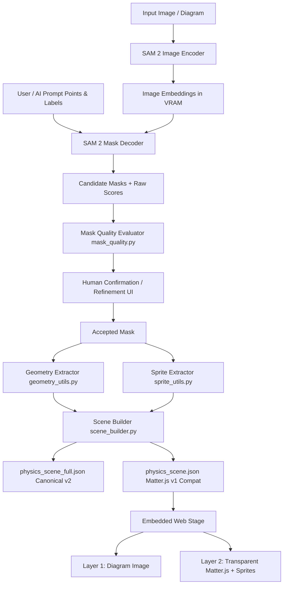
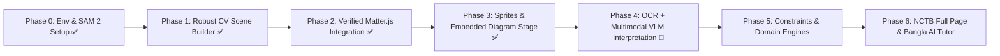

# AI-Enhanced Interactive NCTB Physics Textbook: Complete Project Knowledge Base & Context

> **Project Name**: AugmentedPhysics  
> **Target**: Multimodal NCTB Physics Diagram Understanding, Physics Simulation, and Bangla Intelligent Tutoring  
> **Reference Paper**: *"Augmented Physics: Creating Interactive and Embedded Physics Simulations from Static Textbook Diagrams"* (UIST '24) — Gunturu et al.  
> **Environment**: Windows 11, Python 3.13.5, RTX 3050 Laptop GPU (6 GB VRAM), CUDA 13.0, PyTorch 2.14+, Meta SAM 2 (SAM 2.1 Hiera Tiny).

---

## 1. High-Level Vision & Purpose

This project transforms static physics textbook pages (specifically NCTB Bangladesh curriculum) into an interactive, grounded learning experience:

```
[NCTB Textbook Page / Diagram]
             │
             ▼
[Multimodal Perception: SAM 2 + OCR/VLM]
 (Isolates visual objects & extracts geometry + RGBA sprites)
             │
             ▼
[Canonical PhysicsScene v2 (JSON)]
 (Domain-neutral, preserves uncertainty, no guessed physics)
             │
             ▼
[Scene Compiler & Domain Adapters]
 (Matter.js 2D Rigid-body / Optics / Circuits / GSAP Animation)
             │
             ▼
[Embedded Simulation Stage (Layered HTML/CSS)]
 (Layer 1: Textbook Diagram | Layer 2: Transparent Matter.js Canvas)
             │
             ▼
[Bangla Intelligent Pedagogical Tutor]
 (Grounded in textbook text, diagram geometry, and live simulation state)
```

---

## 2. Core Concepts in Plain Language

| Concept | Plain-Language Explanation | Role in AugmentedPhysics |
| :--- | :--- | :--- |
| **Model Architecture** | The blueprint or neural network design (e.g. SAM 2 Hiera architecture). Like an empty brain design before studying. | Defines how the image encoder, prompt encoder, and mask decoder communicate. |
| **Checkpoint (`.pt`)** | The saved numerical weights resulting from training on millions of images. The "learned experience/brain". | `sam2.1_hiera_tiny.pt` provides the pre-trained weights so SAM 2 knows what object boundaries look like. |
| **PyTorch & CUDA** | PyTorch is the mathematical engine running the neural net; CUDA connects PyTorch directly to NVIDIA GPU hardware cores. | Enables fast, real-time matrix operations on the local RTX 3050 (6 GB) instead of running slow on CPU. |
| **Segmentation Mask** | A binary/per-pixel map ($H \times W$) where $1 = \text{object}$, $0 = \text{background}$. | Isolates the exact pixels of the ball, block, slope, or ground from the textbook background. |
| **Prompt (Points / Boxes)** | Visual cues provided to SAM: positive point (label=1, "include this") or negative point (label=0, "exclude this"). | Allows human or AI to point at a diagram element to extract it without manual lassoing. |
| **Segmentation vs Tracking** | Segmentation isolates an object in a **single static image**. Tracking follows the same object across **multiple video frames**. | Current work is **image segmentation**. Video tracking is for dynamic live-camera/animation later. |
| **Multi-Mask Output** | When a prompt is ambiguous, SAM produces 3 candidate masks with confidence scores. | We re-rank these using stability, prompt consistency, and connectedness to select the true whole object. |
| **Physics Body (Polygon / Circle)** | The invisible mathematical representation ($x, y$ vertices or radius) that calculates collisions, gravity, and velocities. | In real life, physics is invisible. Matter.js calculates momentum and contact along these shapes. |
| **Sprite (Visual Cutout)** | The transparent RGBA image crop extracted from the original diagram using the SAM mask. | Textured onto moving Matter.js bodies so the real textbook object moves and rolls naturally. |
| **Embedded Canvas** | A transparent Matter.js canvas positioned directly over the textbook image. | Allows the simulation to happen directly "inside" the textbook page instead of on a detached gray canvas. |
| **PhysicsScene JSON** | Structured representation storing geometry, author roles, and physics parameters. | The contract separating computer vision from physics simulation engines. |

---

## 3. Milestone Progress to Date

### ✅ Milestone 1: Local SAM 2 Setup & First Single-Object Segmentation
- **Environment Established**: Resolved Windows multi-Python conflict (Python 2.7 -> Python 3.13.5). Created isolated virtual environment `.venv`.
- **GPU Acceleration**: Verified RTX 3050 (6 GB VRAM) with CUDA runtime through PyTorch (`torch.cuda.is_available() == True`).
- **SAM 2 Installed**: Cloned Meta `sam2`, downloaded `sam2.1_hiera_tiny.pt`, resolved Hydra configuration path (`configs/sam2.1/sam2.1_hiera_t.yaml`).
- **Pipeline Execution**: Encoded test image with SAM 2 image predictor, fed a single positive point prompt, generated candidate masks, selected top mask, and visualized overlay.

### ✅ Milestone 2: Multi-Object Segmentation & Candidate Mask Re-ranking
- Tested on multiple objects (e.g., three separate balls in one image).
- **Key Discovery**: The candidate mask with the highest raw SAM predicted-IoU score is often an internal sub-part rather than the whole object. Motivated multi-signal re-ranking (prompt consistency, contour stability, connectedness, overlap penalty).

### ✅ Milestone 3: Robust Interactive Scene Authoring Pipeline
- Built modular CV pipeline under `experiments/`:
  - `build_physics_scene_robust.py`: Interactive Matplotlib GUI (Left click = positive prompt, Right click = negative prompt, D = dynamic, S = static, Enter = accept, Q = export).
  - `mask_quality.py`: Evaluates candidates across SAM score, stability, prompt satisfaction, and connected-component locality.
  - `geometry_utils.py`: Converts pixel masks into simulation geometry (centroid, bounding box, oriented bounding box with angle $\theta$, circle fit radius, simplified convex collision hull, skeleton path).
  - `scene_builder.py`: Maps image coordinates to an $800 \times 600$ simulation canvas while preserving aspect ratio. Generates canonical `physics_scene_full.json` (v2.0) and compatibility `physics_scene.json` (v1.0-compat).

### ✅ Milestone 4: Embedded Diagram Simulation, Sprites & Complex Kinematics
- **Transparent RGBA Sprite Extraction**: Implemented `sprite_utils.py`. Dynamic objects are automatically cut out from the source diagram as transparent PNGs (`/sprites/element_001.png`).
- **Embedded Composite Stage**:
  - `index.html` + `style.css` now use a 2-layer stage:
    - Layer 1: `` (original textbook diagram).
    - Layer 2: Transparent Matter.js canvas overlaid with 1:1 pixel coordinate alignment.
- **Invisible Static Collider Architecture**:
  - For static scenery (curved ramps, ground, walls), the textbook illustration is already visible underneath. Matter.js sets `render.visible = false` on static colliders so no ugly black/gray shapes block the textbook diagram.
- **Concave Polygon Decomposition**:
  - Integrated `poly-decomp` and `Common.setDecomp(decomp)` in Matter.js so curved ramps are automatically decomposed into convex collision pieces, enabling smooth rolling without snagging.
- **Dynamic Spring System**:
  - Built a 1D restoring spring constraint with movable plunger plate in `physicsBodyFactory.js` and `simulation.js`. When the ball rolls down the curve, it collides with the plunger, compresses the spring, and gets propelled backward.
- **Entity Registry & Semantic Authoring**:
  - GUI buttons for `Ball (1)` [dynamic], `Track (2)` [static], `Spring (3)` [static], and `Wall (4)` [static].
  - One-click `▶ SIMULATE`: Automatically extracts sprites, syncs assets to `public/`, spins up the Vite server, and launches the browser tab.

---

## 4. Architecture & Pipeline Breakdown



### Perception vs Physics Separation (Critical Rule)
The canonical `physics_scene_full.json` strictly records **what is visually perceived or confirmed by the author**:
- Geometry (centroids, vertices, radii, angles)
- Masks and coordinates
- Author role (`dynamic`, `static`, `unknown`)
- Semantic labels and sprite dimensions

It **never** invents physical facts:
- `mass_kg`: `null` (unless explicitly provided by text/OCR)
- `initial_velocity`: `null`
- `friction`, `restitution`: `null`
- `gravity`: `null`

Defaults (like `mass_kg = 1.0` or `gravity = 1.0`) are only placed in `physics_scene.json` for engine compatibility, marked with provenance flags.

---

## 5. Teammate Simulation Module: Analysis & Current State

```
simulation_frontend/physics simulation/
├── package.json               # vite, matter-js, poly-decomp
├── index.html                 # Embedded stage (diagram image + transparent canvas)
├── public/                    # physics_scene.json, physics_scene.png, sprites/
└── src/
    ├── main.js                # App entrypoint, scene loading, dynamic object selector
    ├── sceneLoader.js         # Fetches /physics_scene.json with cache-busting
    ├── physicsBodyFactory.js  # Converts JSON objects into Matter.js Bodies + sprites + spring system
    ├── simulation.js          # Transparent renderer, runner, 1D spring constraints, controls
    └── style.css              # Embedded stage layout styling
```

---

## 6. Project Roadmap Ladder



- **Phase 3 (Completed)**: Embedded transparent overlay, RGBA sprite generation, concave ramp decomposition with `poly-decomp`, and spring constraint system.
- **Phase 4 (Next Target - OCR / VLM Semantic Layer)**: Use Gemini / GPT-4V to automatically identify textbook text ($30^\circ$, $m=2\text{ kg}$, $k=200\text{ N/m}$) and bind parameters directly to the canonical scene.
- **Phase 5 (Domain Extensions)**: Support strings, pulleys, pendulums, optics (P5.js ray tracing), circuits, and path animations.
- **Phase 6 (NCTB Book & Bangla Tutor)**: Full-page layout parsing, simulation overlay on original PDF, and dialogue tutor speaking conversational Bangla.
