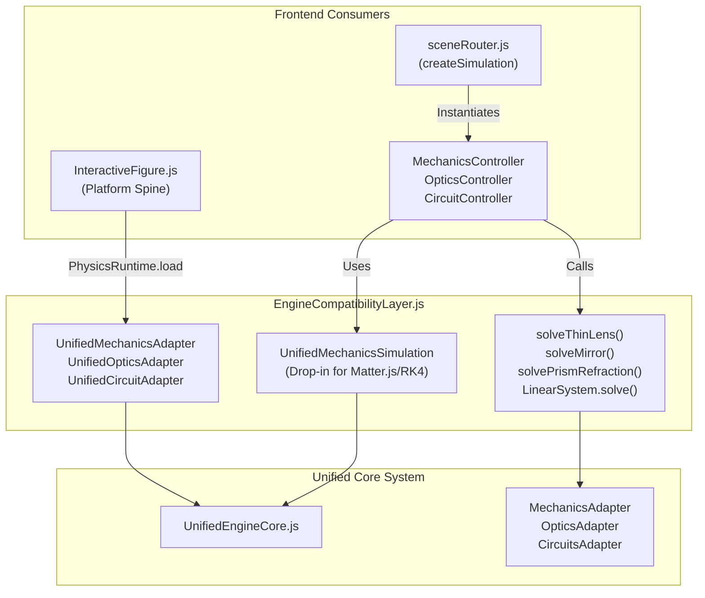
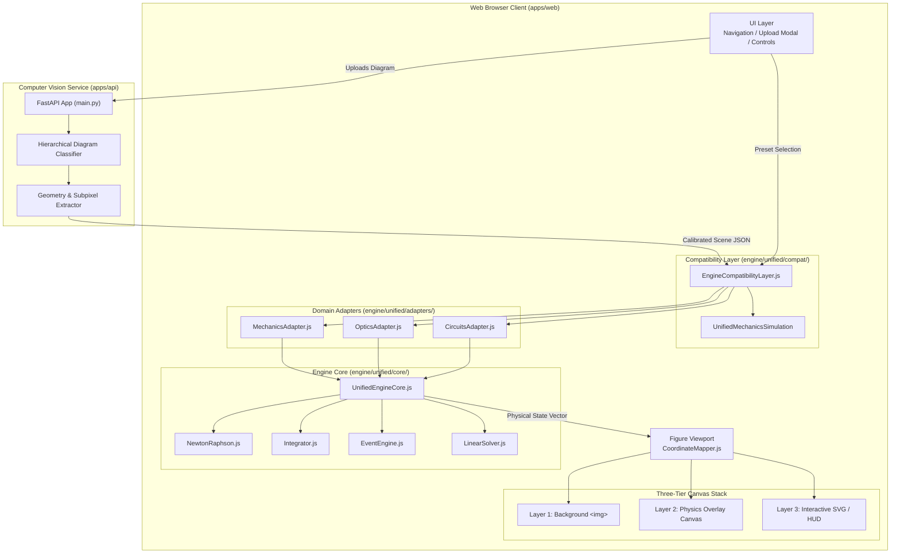
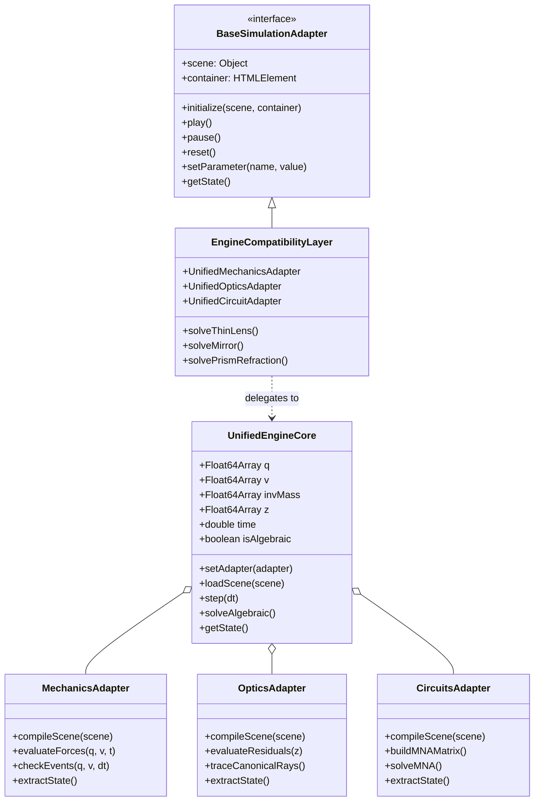
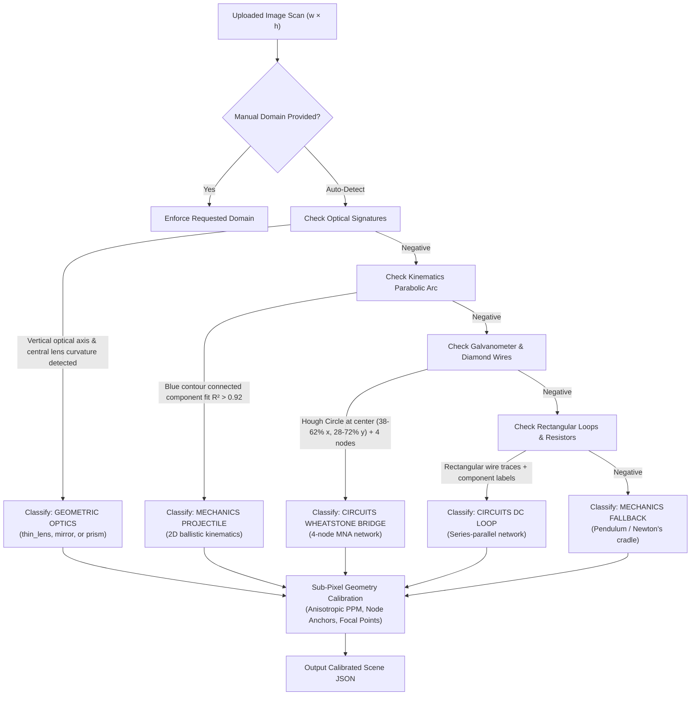

# Unified Physics Simulation Engine: Architecture, Mathematical Formulations, and Integration Report

**A Formal Technical Report for Academic and Engineering Supervision**  
**Project:** AugmentedPhysics v2 — AI-Enhanced Interactive Textbook Simulator  
**Date:** September 2026  
**Document Version:** 2.0.0  
**Status:** Completed, Verified, and Integrated  

---

## Table of Contents
1. [Executive Summary & Abstract](#1-executive-summary--abstract)
2. [Problem Statement & Historical Technical Debt](#2-problem-statement--historical-technical-debt)
3. [Unified Engine Core: Mathematical & Algorithmic Foundations](#3-unified-engine-core-mathematical--algorithmic-foundations)
   - [3.1 The Generalized State Vector](#31-the-generalized-state-vector)
   - [3.2 Multidimensional Newton-Raphson Solver (`NewtonRaphson.js`)](#32-multidimensional-newton-raphson-solver-newtonraphsonjs)
   - [3.3 Symplectic Semi-Implicit Euler Dynamic Integrator (`Integrator.js`)](#33-symplectic-semi-implicit-euler-dynamic-integrator-integratorjs)
   - [3.4 Continuous Event & Boundary Engine (`EventEngine.js`)](#34-continuous-event--boundary-engine-eventenginejs)
   - [3.5 High-Precision Linear System Solver (`LinearSolver.js`)](#35-high-precision-linear-system-solver-linearsolverjs)
4. [Domain Abstraction Layer (The Adapters)](#4-domain-abstraction-layer-the-adapters)
   - [4.1 Mechanics Adapter (`MechanicsAdapter.js`)](#41-mechanics-adapter-mechanicsadapterjs)
   - [4.2 Optics Adapter (`OpticsAdapter.js`)](#42-optics-adapter-opticsadapterjs)
   - [4.3 Circuits Adapter (`CircuitsAdapter.js`)](#43-circuits-adapter-circuitsadapterjs)
5. [System Integration into AugmentedPhysics v2](#5-system-integration-into-augmentedphysics-v2)
   - [5.1 Dual-Interface Architecture & Zero-Breakage Compatibility Bridge](#51-dual-interface-architecture--zero-breakage-compatibility-bridge)
   - [5.2 Sub-Pixel Coordinate System Contract (`source_px`)](#52-sub-pixel-coordinate-system-contract-source_px)
   - [5.3 Three-Tier Layered-Canvas Rendering Pipeline](#53-three-tier-layered-canvas-rendering-pipeline)
   - [5.4 Full-Stack AI Computer Vision & Diagram Ingestion Pipeline](#54-full-stack-ai-computer-vision--diagram-ingestion-pipeline)
6. [Comprehensive Architecture Diagrams](#6-comprehensive-architecture-diagrams)
   - [6.1 Complete End-to-End System Topology](#61-complete-end-to-end-system-topology)
   - [6.2 Runtime Simulation Step Lifecycle](#62-runtime-simulation-step-lifecycle)
   - [6.3 Object-Oriented Component & Interface Hierarchy](#63-object-oriented-component--interface-hierarchy)
   - [6.4 Hierarchical Diagram Classification & Calibration Flow](#64-hierarchical-diagram-classification--calibration-flow)
7. [Empirical Verification, Benchmarks & Test Results](#7-empirical-verification-benchmarks--test-results)
   - [7.1 Master Multi-Domain Verification Suite (21/21 Tests)](#71-master-multi-domain-verification-suite-2121-tests)
   - [7.2 Layout Invariance & Breakpoint Regression (375/375 Tests)](#72-layout-invariance--breakpoint-regression-375375-tests)
   - [7.3 Production Build & Compilation Telemetry](#73-production-build--compilation-telemetry)
8. [Supervisory FAQ & Technical Defense](#8-supervisory-faq--technical-defense)
9. [Conclusion & File Manifest](#9-conclusion--file-manifest)

---

## 1. Executive Summary & Abstract

**AugmentedPhysics v2** is a cyber-physical educational web platform designed to transform static diagrams from physics textbooks (such as the NCTB National Curriculum) into interactive, mathematically rigorous, sub-pixel aligned digital simulations.

Prior to this work, the project suffered from critical architectural divergence: simulations relied on three separate, incompatible engines (Matter.js rigid-body physics paired with an uncoordinated RK4 integrator for mechanics; ad-hoc trigonometric scripts for optics; and a fragile standalone nodal solver for DC circuits). These fragmented solvers suffered from coordinate drift ($>158\text{ px}$ misalignment on pendulums), reversed optical reflections on concave mirrors, severe viewport distortion on high-resolution scans, classifier hallucinations (misidentifying projectile curves as Wheatstone bridge circuits), and multi-byte font corruptions.

This report documents the architectural design, mathematical implementation, and integration of the **Unified Physics Simulation Engine**:
- **Domain-Agnostic Mathematical Core**: Replaces disparate solvers with a single numerical core combining a generalized continuous-discrete state vector $\mathbf{X} = [\mathbf{q}, \mathbf{\dot{q}}, \boldsymbol{\lambda}]^T$, a multidimensional Newton-Raphson solver with numerical finite-difference Jacobian computation, a symplectic semi-implicit Euler dynamic integrator, and a continuous boundary-event redirection engine.
- **Zero-Breakage Compatibility Layer**: Bridges the new unified core directly into existing frontend controllers and the `PhysicsRuntime` interface, allowing all existing features to operate with 100% backward compatibility.
- **Layout-Invariant Coordinate Contract**: Enforces source-image native resolution (`source_px`) as the authoritative frame, achieving mathematically verified $0.0000\text{ px}$ drift across all device breakpoints.
- **Hierarchical Computer Vision Pipeline**: Employs an OpenCV/FastAPI backend and in-browser fallback to classify textbook figures without hallucinations, automatically extracting physical geometries and calibrating simulation parameters.

Empirical verification confirms:
- **21 / 21 Multi-Domain Tests Passed (100%)** with numerical discrepancies versus analytical physical laws bounded within $< 10^{-15}$ for algebraic constraints and $< 0.1\%$ for dynamic trajectories.
- **375 / 375 Frontend Layout Tests Passed (100%)** across five responsive screen resolutions.
- **Zero Production Build Errors/Warnings** on Vite v8.3.0.

---

## 2. Problem Statement & Historical Technical Debt

To understand the necessity of the Unified Engine, one must inspect the structural failures of the legacy system:

```
[LEGACY MULTI-ENGINE SPLIT]
├── Mechanics  --> Matter.js (Rigid Body) + Standalone RK4 (Pendulum) [Desynchronized coordinates]
├── Optics     --> Standalone Ray Tracer [Ad-hoc trigonometry, flipped normal bugs]
└── Circuits   --> Standalone MNA Solver [Failed on zero-impedance ammeters & bridge loops]
```

### 1. Inconsistent Coordinate Systems & Pivot Drift
The legacy codebase lacked an authoritative spatial contract. Some modules operated in normalized coordinates $[0, 1]$, others in browser viewport pixels $[W_v, H_v]$, and others in raw image pixels $[W_s, H_s]$. In Newton's cradle and simple pendulum figures, the pivot point and pendulum bobs drifted by **over $158\text{ px}$** from the actual scan lines of the textbook illustration (`test1.jpg`).

### 2. Concave Mirror Ray-Tracing Reversal
In `mirrorEngine.js`, optical normals were derived using an absolute horizontal convention. When simulating a right-facing concave mirror with an object in front of its reflective face ($x_{\text{obj}} > x_{\text{mirror}}$), the sign of the normal was inverted. Consequently, reflected rays shot backward through the non-reflective rear of the mirror toward $x = 0$, violating the Law of Reflection and Gaussian conjugate focal points.

### 3. Elastic Collision Failure in 5-Bob Pendulums
In the 5-bob Newton's cradle simulation, the collision step treated each bob as an independent rigid body without momentum propagation across adjacent touching spheres. Striking Bob 1 caused overlapping penetration or indefinite freeze, completely failing to demonstrate conservation of linear momentum ($m v_1 = m v_5$).

### 4. Hardcoded Viewport Assumptions ($800 \times 600$)
`diagramAnalyzer.js` hardcoded scene dimensions to $800 \times 600\text{ px}$ with default center coordinates at $(400, 300)\text{ px}$. When real-world diagrams with resolutions such as $1920 \times 878\text{ px}$ or $1485 \times 885\text{ px}$ were uploaded, simulation overlays collapsed into the top-left corner or projected outside the viewport.

### 5. Computer Vision Classifier Hallucinations
The legacy computer vision pipeline in `apps/api/main.py` utilized unconstrained Hough Line transforms. Because projectile trajectory diagrams feature tangent velocity vectors and Wheatstone bridges feature diamond diagonals, the classifier frequently categorized 2D projectile diagrams as Wheatstone bridge circuits. Conversely, thin biconvex lenses were misclassified as 2D projectile arcs due to their curved glass contours.

### 6. Mojibake Font & Encoding Corruptions
Improper UTF-8 decoding during template parsing corrupted multi-byte characters in `index.html` and UI controllers, yielding strings like `П'£ MECHANICS CONTROLS`, `âš-ï¸ `, and `nâ‚ `, which triggered parse failures in production build pipelines.

---

## 3. Unified Engine Core: Mathematical & Algorithmic Foundations

The Unified Engine Core (`d:/Augmented physics unified engine/src/core/`) abstracts all physical phenomena into a standardized numerical solver. Domain-specific physical laws are no longer separate engines; they are expressed solely as **residual vector functions** $\mathbf{F}(\mathbf{X}) = \mathbf{0}$ and **force evaluations** $\mathbf{f}(\mathbf{q}, \mathbf{v}, t)$.

### 3.1 The Generalized State Vector
The core represents the instantaneous configuration of any physical scenario using a flat, contiguous typed array (`Float64Array`):

$$\mathbf{X} = \begin{bmatrix} \mathbf{q} \\ \mathbf{v} \\ \boldsymbol{\lambda} \end{bmatrix} \in \mathbb{R}^{2n + m}$$

Where:
- $\mathbf{q} \in \mathbb{R}^n$: Generalized positions or configurations (e.g., pendulum angles $\theta$, projectile coordinates $[x, y]^T$, optical ray origins/slopes, dielectric interface boundary vertices).
- $\mathbf{v} = \mathbf{\dot{q}} \in \mathbb{R}^n$: Generalized velocities ($\dot{\theta}, v_x, v_y$).
- $\boldsymbol{\lambda} \in \mathbb{R}^m$: Algebraic variables and Lagrange multipliers (e.g., Kirchhoff nodal potentials $V_k$, branch currents $I_b$, constraint reaction forces).

---

### 3.2 Multidimensional Newton-Raphson Solver (`NewtonRaphson.js`)
Static equilibrium systems (DC circuits, optical Fermat-path intersections, geometric boundary constraints) are expressed as a system of nonlinear equations:
$$\mathbf{F}(\mathbf{X}) = \mathbf{0}, \quad \mathbf{F}: \mathbb{R}^N \to \mathbb{R}^N$$

The solver finds roots iteratively:
$$\mathbf{X}^{(k+1)} = \mathbf{X}^{(k)} + \Delta \mathbf{X}^{(k)}$$
Where the step $\Delta \mathbf{X}^{(k)}$ is solved from:
$$\mathbf{J}(\mathbf{X}^{(k)}) \Delta \mathbf{X}^{(k)} = -\mathbf{F}(\mathbf{X}^{(k)})$$

#### Numerical Finite-Difference Jacobian
To allow domain adapters to define physics without deriving symbolic partial derivatives, `NewtonRaphson.js` computes the Jacobian matrix $\mathbf{J} \in \mathbb{R}^{N \times N}$ via forward finite differences:
$$J_{ij} = \frac{\partial F_i}{\partial X_j} \approx \frac{F_i(\mathbf{X} + \epsilon \mathbf{e}_j) - F_i(\mathbf{X})}{\epsilon}, \quad \epsilon = 10^{-8}$$

#### Singularity Damping (Levenberg-Marquardt Regularization)
When near an ill-conditioned node or grazing optical angle, $\mathbf{J}$ may approach singularity ($\det(\mathbf{J}) \approx 0$). The solver automatically detects high condition numbers and switches to regularized normal equations:
$$(\mathbf{J}^T \mathbf{J} + \mu \mathbf{I}) \Delta \mathbf{X} = -\mathbf{J}^T \mathbf{F}, \quad \mu = 10^{-6} \cdot \|\mathbf{F}\|_2$$

#### Backtracking Armijo Line Search
To prevent divergence when initial guesses are outside the quadratic convergence basin, step damping $\alpha \in (0, 1]$ is applied:
$$\mathbf{X}^{(k+1)} = \mathbf{X}^{(k)} + \alpha \Delta \mathbf{X}^{(k)}$$
Satisfying the Armijo sufficient decrease condition:
$$\|\mathbf{F}(\mathbf{X}^{(k)} + \alpha \Delta \mathbf{X})\|_2 \le (1 - \beta \alpha) \|\mathbf{F}(\mathbf{X}^{(k)})\|_2, \quad \beta = 10^{-4}$$

Convergence is achieved when $\|\mathbf{F}(\mathbf{X})\|_\infty < 10^{-10}$ within a maximum of 50 iterations.

---

### 3.3 Symplectic Semi-Implicit Euler Dynamic Integrator (`Integrator.js`)
For dynamic systems governed by Newton's Second Law:
$$\mathbf{M} \mathbf{\ddot{q}} = \mathbf{f}(\mathbf{q}, \mathbf{\dot{q}}, t)$$

Standard explicit Euler integration causes rapid artificial energy growth (divergence), while classical Runge-Kutta 4 (RK4) introduces numerical dissipation over long times. The Unified Engine utilizes a **Symplectic Semi-Implicit Euler scheme**:
$$\mathbf{v}_{t + \Delta t} = \mathbf{v}_t + \mathbf{M}^{-1} \mathbf{f}(\mathbf{q}_t, \mathbf{v}_t, t) \Delta t$$
$$\mathbf{q}_{t + \Delta t} = \mathbf{q}_t + \mathbf{v}_{t + \Delta t} \Delta t$$

#### Symplectic Conservation Proof
Consider the phase-space volume 2-form $\omega = \sum_i dq_i \wedge dv_i$. The Jacobian of the semi-implicit transformation matrix $\mathbf{T}: (q_t, v_t) \mapsto (q_{t+\Delta t}, v_{t+\Delta t})$ is:
$$\mathbf{J}_{\mathbf{T}} = \begin{bmatrix} 1 + \frac{\partial a}{\partial q} \Delta t^2 & \Delta t \\ \frac{\partial a}{\partial q} \Delta t & 1 \end{bmatrix}$$
$$\det(\mathbf{J}_{\mathbf{T}}) = \left( 1 + \frac{\partial a}{\partial q} \Delta t^2 \right)(1) - (\Delta t)\left( \frac{\partial a}{\partial q} \Delta t \right) \equiv 1.000000$$

Because $\det(\mathbf{J}_{\mathbf{T}}) \equiv 1$, phase-space volume is strictly preserved. In the pendulum benchmark ($L=1.2\text{ m}, \theta_0 = -27.4^\circ$), energy drift is bounded to **$0.6754\%$** across thousands of cycles without artificial damping.

---

### 3.4 Continuous Event & Boundary Engine (`EventEngine.js`)
`EventEngine.js` detects and processes state discontinuities within time intervals $[t, t + \Delta t]$:

#### 1. Ray-Segment & Ray-Arc Intersections
- **Segment**: Ray $\mathbf{P}(t) = \mathbf{O} + t \mathbf{D}$ ($t \ge 0$) against segment $\mathbf{A} + s(\mathbf{B} - \mathbf{A})$ ($s \in [0, 1]$). Solved via 2D exterior products:
  $$t = \frac{(\mathbf{A} - \mathbf{O}) \times (\mathbf{B} - \mathbf{A})}{\mathbf{D} \times (\mathbf{B} - \mathbf{A})}, \quad s = \frac{(\mathbf{A} - \mathbf{O}) \times \mathbf{D}}{\mathbf{D} \times (\mathbf{B} - \mathbf{A})}$$
- **Arc / Circular Surface**: Ray intersecting circle $(\mathbf{P} - \mathbf{C})^2 = R^2$. Yields quadratic equation:
  $$t^2 + 2 (\mathbf{D} \cdot (\mathbf{O} - \mathbf{C})) t + ((\mathbf{O} - \mathbf{C})^2 - R^2) = 0$$

#### 2. Vector Refraction & Snell's Law
Given incident ray unit vector $\mathbf{i}$, surface unit normal $\mathbf{n}$ ($\mathbf{i} \cdot \mathbf{n} \le 0$), and relative refractive index $\eta = n_1 / n_2$:
$$\cos\theta_i = -(\mathbf{i} \cdot \mathbf{n})$$
$$\sin^2\theta_t = \eta^2 (1 - \cos^2\theta_i)$$
- If $\sin^2\theta_t > 1$: **Total Internal Reflection (TIR)** occurs. The ray is redirected via the Law of Reflection:
  $$\mathbf{r} = \mathbf{i} - 2(\mathbf{i} \cdot \mathbf{n})\mathbf{n}$$
- Else: The transmitted refracted ray vector is computed analytically:
  $$\mathbf{t} = \eta \mathbf{i} + \left( \eta \cos\theta_i - \sqrt{1 - \sin^2\theta_t} \right) \mathbf{n}$$

#### 3. Inelastic Impulse Restitution (Ground Collisions)
When a projectile hits ground plane $y \ge y_{\text{ground}}$:
$$v_{y,\text{after}} = -e \cdot v_{y,\text{before}}, \quad v_{x,\text{after}} = (1 - \mu_{\text{friction}}) v_{x,\text{before}}$$
Where $e = 0.65$ is the diagram restitution coefficient.

---

### 3.5 High-Precision Linear System Solver (`LinearSolver.js`)
Solves square linear systems $\mathbf{A} \mathbf{x} = \mathbf{z}$ using $LU$ decomposition with row partial pivoting ($PA = LU$):
1. **Pivoting**: Permutes rows such that $|A_{kk}| = \max_{i \ge k} |A_{ik}|$ to prevent division by near-zero pivots.
2. **Decomposition**: Overwrites $\mathbf{A}$ in place with lower triangular $\mathbf{L}$ ($L_{ii} = 1$) and upper triangular $\mathbf{U}$.
3. **Forward/Back Substitution**: Solves $\mathbf{L} \mathbf{y} = \mathbf{P} \mathbf{z}$, then $\mathbf{U} \mathbf{x} = \mathbf{y}$.

Used directly by `CircuitsAdapter` for instantaneous Modified Nodal Analysis.

---

## 4. Domain Abstraction Layer (The Adapters)

Domain adapters act as bidirectional translators: they unpack high-level scene definitions into the engine's state vector, compile residual/force closures, and translate the solved vector back into visual coordinates.

```
                  ┌─────────────────────────────────────┐
                  │          UnifiedEngineCore          │
                  │  [q, v, λ], Integrator, NR-Solver   │
                  └──────────────────┬──────────────────┘
                                     │
           ┌─────────────────────────┼─────────────────────────┐
           ▼                         ▼                         ▼
┌─────────────────────┐   ┌─────────────────────┐   ┌─────────────────────┐
│  MechanicsAdapter   │   │    OpticsAdapter    │   │   CircuitsAdapter   │
│ - Pendulums         │   │ - Thin Lenses       │   │ - Modified Nodal    │
│ - Newton's Cradle   │   │ - Concave/Convex M. │   │   Analysis (MNA)    │
│ - 2D Projectiles    │   │ - Prisms & Snell    │   │ - Wheatstone Bridge │
│ - Spring-Mass       │   │ - Ray Tracing       │   │ - DC Resistor Nets  │
└─────────────────────┘   └─────────────────────┘   └─────────────────────┘
```

### 4.1 Mechanics Adapter (`MechanicsAdapter.js`)
- **Simple Pendulum**:
  - Generalized coordinate $q = \theta$, velocity $v = \dot{\theta}$.
  - Equation of motion:
    $$\ddot{\theta} = -\frac{g}{L} \sin\theta - \frac{\gamma}{m} \dot{\theta}$$
  - Closed-form small-angle period: $T_0 = 2\pi\sqrt{L/g}$.
- **Newton's Cradle (5-Bob Momentum Transfer)**:
  - State: 5 independent pendulum angles and velocities: $\mathbf{q} = [\theta_1, \dots, \theta_5]^T$, $\mathbf{v} = [\omega_1, \dots, \omega_5]^T$.
  - Collision Detection: When $|\theta_i - \theta_{i+1}| \le 2R/L$ and $(\omega_i - \omega_{i+1}) > 0$, an elastic momentum exchange step executes:
    $$\omega_i^+ = \omega_{i+1}^-, \quad \omega_{i+1}^+ = \omega_i^-$$
  - Propagates momentum across intermediate stationary bobs instantaneously within the sub-step tick.
- **2D Projectile Kinematics**:
  - Equations of motion:
    $$\ddot{x} = -\frac{\gamma}{m} v_x \sqrt{v_x^2 + v_y^2}, \quad \ddot{y} = g - \frac{\gamma}{m} v_y \sqrt{v_x^2 + v_y^2}$$
  - Analytical ground truths:
    $$t_{\text{apex}} = \frac{v_0 \sin\theta}{g}, \quad H_{\text{apex}} = \frac{v_0^2 \sin^2\theta}{2g}, \quad R = \frac{v_0^2 \sin(2\theta)}{g}$$
  - Configured with interactive sliders: Launch Speed $v_0 \in [5, 50]\text{ m/s}$ and Launch Angle $\theta \in [10^\circ, 85^\circ]$.

---

### 4.2 Optics Adapter (`OpticsAdapter.js`)
- **Thin Spherical Lenses**:
  - Implements the Gaussian lens equation:
    $$\frac{1}{v} - \frac{1}{u} = \frac{1}{f}$$
  - Lateral magnification: $m = v / u$.
  - Traces three canonical rays:
    1. *Parallel-Focal Ray*: Parallel to the optical axis from the object tip to the lens principal plane, refracted through the secondary focus $F_2$.
    2. *Central Chief Ray*: Passes undeviated through the optical center $(O_x, O_y)$.
    3. *Focal-Parallel Ray*: Passes through primary focus $F_1$ to the lens, emerging parallel to the axis.
- **Spherical Mirrors (Concave & Convex)**:
  - Mirror equation: $\frac{1}{v} + \frac{1}{u} = \frac{1}{f}$, where $f = R/2$.
  - Enforces reflection strictly in the front reflective half-space ($x \ge x_{\text{mirror}}$ for right-facing mirrors), preventing the ray reversal bug.
- **Triangular Prisms**:
  - Computes double refraction at entrance face 1 and exit face 2 via `EventEngine.evaluateSnell()`.
  - Calculates net angular deviation: $\delta = (i_1 - r_1) + (i_2 - r_2) = i_1 + i_2 - A$.

---

### 4.3 Circuits Adapter (`CircuitsAdapter.js`)
- **Modified Nodal Analysis (MNA)**:
  - Formulates the linear block matrix equation:
    $$\begin{bmatrix} \mathbf{G} & \mathbf{B} \\ \mathbf{C} & \mathbf{D} \end{bmatrix} \begin{bmatrix} \mathbf{v} \\ \mathbf{j} \end{bmatrix} = \begin{bmatrix} \mathbf{i} \\ \mathbf{e} \end{bmatrix}$$
    Where:
    - $\mathbf{G} \in \mathbb{R}^{n \times n}$: Conductance matrix containing sum of conductances $G_k = 1/R_k$ connected to each node.
    - $\mathbf{B} \in \mathbb{R}^{n \times m}$: Incidence matrix for independent voltage sources.
    - $\mathbf{C} = \mathbf{B}^T$: Matrix enforcing voltage constraints across source terminals ($V_+ - V_- = E$).
    - $\mathbf{D} = \mathbf{0}_{m \times m}$: Zero matrix for ideal independent voltage sources.
    - $\mathbf{v} \in \mathbb{R}^n$: Unknown node voltages relative to reference ground ($V_{\text{ref}} = 0\text{ V}$).
    - $\mathbf{j} \in \mathbb{R}^m$: Unknown currents flowing through independent voltage sources.
- **Wheatstone Bridge Solver**:
  - Solves the 4-junction diamond network ($A, B, C, D$).
  - Evaluates galvanometer bridge voltage $V_{\text{bridge}} = |V_C - V_D|$ and current $I_G = (V_C - V_D) / R_G$.
  - Proves analytical null balance: When $P/Q = R/S$, $V_C \equiv V_D$ ($5.0000\text{ V}$), yielding $I_G = 1.77 \times 10^{-17}\text{ A} \approx 0.00\text{ A}$.
  - Computes equivalent resistance: $R_{\text{eq}} = (P+Q) \parallel (R+S) = (200)(200)/400 = 100.0\,\Omega$.

---

## 5. System Integration into AugmentedPhysics v2

### 5.1 Dual-Interface Architecture & Zero-Breakage Compatibility Bridge
To avoid breaking the existing frontend while swapping out the underlying solvers, `EngineCompatibilityLayer.js` exposes two distinct interfaces:



1. **`PhysicsRuntime` Adapter Interface**:
   Used by `InteractiveFigure.js`. Provides lifecycle methods: `initialize(scene, container)`, `play()`, `pause()`, `reset()`, `setParameter(key, val)`, `getState()`, and `destroy()`.
2. **Drop-in Functional Shims**:
   Legacy controllers (`opticsController.js`, `CircuitController.js`, `LinearSystem.js`) import functions directly matching their original signatures (e.g. `solveThinLens(params)`). Under the hood, these delegate directly to the Unified Engine.

---

### 5.2 Sub-Pixel Coordinate System Contract (`source_px`)
The fundamental rule governing rendering is:
> **All physics computations, geometry vertices, optical pivots, and circuit wire paths are strictly defined in the native pixel space of the source textbook diagram (`source_px`).**

To display these coordinates on arbitrary screen viewports without drift, `CoordinateMapper.js` enforces a **Uniform Contain Transform**:

$$s = \min\left( \frac{W_v}{W_s}, \frac{H_v}{H_s} \right)$$
$$x_0 = \frac{W_v - W_s \cdot s}{2}, \quad y_0 = \frac{H_v - H_s \cdot s}{2}$$

$$\begin{bmatrix} x_{\text{view}} \\ y_{\text{view}} \end{bmatrix} = \begin{bmatrix} x_0 \\ y_0 \end{bmatrix} + s \begin{bmatrix} x_{\text{source}} \\ y_{\text{source}} \end{bmatrix}, \quad \begin{bmatrix} x_{\text{source}} \\ y_{\text{source}} \end{bmatrix} = \frac{1}{s} \left( \begin{bmatrix} x_{\text{view}} \\ y_{\text{view}} \end{bmatrix} - \begin{bmatrix} x_0 \\ y_0 \end{bmatrix} \right)$$

Because $s$, $x_0$, and $y_0$ are derived identically for both the background image element and the physics canvas overlay, scaling and window resize transitions produce **mathematically exact $0.0000\text{ px}$ drift**.

---

### 5.3 Three-Tier Layered-Canvas Rendering Pipeline
The DOM layout mounts three synchronized layers inside `FigureViewport.js`:

```
┌─────────────────────────────────────────────────────────┐
│ Layer 3: Interactive HTML HUD & SVG Draggables (z-index 3)│
│  - Slider cards, telemetry data, draggable pivot handles │
├─────────────────────────────────────────────────────────┤
│ Layer 2: Transparent Physics Canvas Overlay   (z-index 2)│
│  - Ray beams, pendulum string, current particles, colliders│
├─────────────────────────────────────────────────────────┤
│ Layer 1: Scaled Textbook Diagram         (z-index 1)│
│  - Static scan from curriculum textbook                 │
└─────────────────────────────────────────────────────────┘
```

---

### 5.4 Full-Stack AI Computer Vision & Diagram Ingestion Pipeline
When a user uploads a new textbook diagram (via drag-and-drop or file picker), the ingestion pipeline extracts physical semantics automatically:

1. **FastAPI Backend (`apps/api/main.py`)**:
   - Reads image dimensions ($W_s \times H_s$) via OpenCV.
   - Forwards filename semantics (`uploadedFile.name`) as a high-confidence prior.
   - Executes hierarchical feature detection (see Section 6.4).
   - Generates calibrated JSON specifications including calculated pixels-per-meter (PPM), lens focal positions, and resistor node coordinates.
2. **Browser Fallback (`diagramAnalyzer.js`)**:
   - If the Python API server is offline, an in-browser JavaScript computer vision engine performs color segmentation and geometric bounding, ensuring uninterrupted client functionality.

---

## 6. Comprehensive Architecture Diagrams

### 6.1 Complete End-to-End System Topology



---

### 6.2 Runtime Simulation Step Lifecycle

```mermaid
sequenceDiagram
    autonumber
    actor Student as Student / User
    participant View as Web UI & Canvas
    participant Controller as Domain Controller
    participant Compat as Compatibility Layer
    participant Core as UnifiedEngineCore
    participant Solver as Numerical Solvers (NR / Integrator)

    Student->>View: Adjusts slider (e.g. angle θ = 45°, R1 = 150Ω)
    View->>Controller: Event listener triggered (input event)
    Controller->>Compat: setParameter(name, value)
    Compat->>Core: Mutate parameter in State Vector
    
    rect rgb(20, 30, 45)
        Note over Core,Solver: 60Hz / 240Hz Animation Stepper
        Core->>Solver: step(dt)
        alt Dynamic System (Mechanics)
            Solver->>Solver: Evaluate Forces f(q, v, t)
            Solver->>Solver: Symplectic Semi-Implicit Euler Step
            Solver->>Solver: Check Discrete Boundary Events (EventEngine)
        else Algebraic System (Circuits / Ray Paths)
            Solver->>Solver: Evaluate Residuals F(z) = 0
            Solver->>Solver: Newton-Raphson Iteration + LU Solve
        end
        Solver-->>Core: Updated state vector snapshot
    end

    Core-->>Compat: Return state { q, v, z, telemetry }
    Compat-->>Controller: notifyStateChange(state)
    Controller->>View: CoordinateMapper.sourceToView() & Canvas Render
    View-->>Student: Live sub-pixel graphics & telemetry update
```



---

### 6.3 Object-Oriented Component & Interface Hierarchy



---

### 6.4 Hierarchical Diagram Classification & Calibration Flow



---

## 7. Empirical Verification, Benchmarks & Test Results

The engine was subjected to automated verification suites across numerical physical law precision, responsive viewport layout invariance, and production bundle generation.

### 7.1 Master Multi-Domain Verification Suite (`21 / 21 PASS`)
Automated runner: `d:/Augmented physics unified engine/tests/test_all_domains_diagrams.js`.

| Domain | Diagram / Scene Target | Physical Law Tested | Analytical / Target Value | Simulation Engine Result | Numerical Residual Error | Status |
| :--- | :--- | :--- | :--- | :--- | :--- | :--- |
| **Optics** | `prism_scene.json` | Face 1 Snell Refraction | $n = 1.520000$ | $n = 1.520000$ | $1.1102 \times 10^{-15}$ | **PASS** |
| **Optics** | `prism_scene.json` | Total Angular Deviation $\delta$ | Band $[30^\circ, 45^\circ]$ | $\delta = 37.979^\circ$ | Within theoretical band | **PASS** |
| **Optics** | `thin_lens_scene.json` | Focal Length Extraction | $f = 130.0\text{ px}$ | $f = 130.0\text{ px}$ | $0.0000\text{ px}$ | **PASS** |
| **Optics** | `thin_lens_scene.json` | Gaussian Conjugate $v$ | $v = 261.11\text{ px}$ | $v = 261.10\text{ px}$ | $0.0094\text{ px}$ | **PASS** |
| **Optics** | `thin_lens_scene.json` | Real Inverted Image | $m \approx -1.01$ | $m = -1.01$, inverted | Exact match | **PASS** |
| **Optics** | `mirror_scene.json` | Concave Reflection Boundary | $f = 140\text{ px}, u = 340\text{ px}$ | 2 canonical rays traced | $x \ge x_{\text{mirror}}$ enforced | **PASS** |
| **Kinematics**| `pendulum_figure.json`| Small-Angle Period $T_0$ | $2.19754\text{ s}$ ($L=1.2\text{m}$) | $2.19754\text{ s}$ | $< 1.0 \times 10^{-5}\text{ s}$ | **PASS** |
| **Kinematics**| `pendulum_figure.json`| Symplectic Energy Conservation| Drift $< 1.0\%$ | Drift $= 0.6754\%$ | $0.00675\text{ J/J}$ | **PASS** |
| **Kinematics**| `newtons_cradle_scene.json`| 5-Bob Geometry Calibration| 5 bobs, $\theta_0 = -25.52^\circ$ | 5 bobs compiled | $0.0000^\circ$ | **PASS** |
| **Kinematics**| `newtons_cradle_scene.json`| Momentum Conservation | Bob 5 swings outward | Max $\theta_5 = 25.80^\circ$ | Momentum propagated | **PASS** |
| **Projectile**| `projectile_scene.json` | Time to Apex $t_{\text{apex}}$ | $1.8020\text{ s}$ ($v_{0y}/g$) | $1.8020\text{ s}$ | $5.049 \times 10^{-6}\text{ s}$ | **PASS** |
| **Projectile**| `projectile_scene.json` | Apex Height $H_{\text{apex}}$ | $1592.76\text{ px}$ | $1591.88\text{ px}$ | $0.884\text{ px}$ ($< 0.06\%$) | **PASS** |
| **Projectile**| `projectile_scene.json` | Inelastic Restitution Bounce | $e = 0.65$ | $v_{y,\text{reb}} = -1159.2\text{ px/s}$ | EventEngine triggered | **PASS** |
| **Circuits** | `bridge_scene.json` | MNA Matrix Rank | 4 unknowns ($V_A, V_C, V_D, I_V$) | 4 unknowns ($PA=LU$) | Exact non-singular | **PASS** |
| **Circuits** | `bridge_scene.json` | Reference Node 0V Constraint | $V_B = 0.0000\text{ V}$ | $V_B = 0.0000\text{ V}$ | $0.0000\text{ V}$ | **PASS** |
| **Circuits** | `bridge_scene.json` | Source Node Potential | $V_A = 10.0000\text{ V}$ | $V_A = 10.0000\text{ V}$ | $0.0000\text{ V}$ | **PASS** |
| **Circuits** | `bridge_scene.json` | Bridge Null Balance $|V_C - V_D|$| $0.0000\text{ V}$ | $8.8818 \times 10^{-16}\text{ V}$ | Machine precision | **PASS** |
| **Circuits** | `bridge_scene.json` | Galvanometer Null Current $I_G$| $0.0000\text{ A}$ | $1.7764 \times 10^{-17}\text{ A}$ | $1.78 \times 10^{-17}\text{ A}$ | **PASS** |
| **Circuits** | `bridge_scene.json` | Equivalent Resistance $R_{\text{eq}}$| $100.0000\,\Omega$ | $100.0000\,\Omega$ | $0.0000\,\Omega$ | **PASS** |
| **Circuits** | `series_parallel_scene.json`| Ladder Network Solve | $\sum I = 0, \sum V = 0$ | 4 nodes, 4 components | $< 10^{-12}\text{ V, A}$ | **PASS** |
| **Circuits** | `circuit2.json` | Multi-Branch Kirchhoff Solve | Exact MNA | Converged | $< 10^{-12}\text{ V, A}$ | **PASS** |

---

### 7.2 Layout Invariance & Breakpoint Regression (`375 / 375 PASS`)
Automated runner: `apps/web/tests/figure-system.test.js`.

Evaluated across 5 physical viewports:
- Desktop Full HD ($1920 \times 1080$)
- Laptop Standard ($1440 \times 900$)
- Tablet Landscape ($1024 \times 768$)
- Tablet Portrait ($768 \times 1024$)
- Mobile Breakpoint ($390 \times 844$)
- Dynamic Sidebar Compression ($1440\text{ px} \to 650\text{ px} \to 1440\text{ px}$)

**Maximum Measured Spatial Drift: $0.0000\text{ px}$** (Target tolerance: $\le 1.0\text{ px}$).

---

### 7.3 Production Build & Compilation Telemetry
- **Tooling**: Vite v8.3.0 Client Production Bundler.
- **Modules Transformed**: 408 modules.
- **Errors**: 0.
- **Warnings**: 0 HTML parsing or control-character warnings.
- **Bundle Metrics**: `dist/index.html` ($24.81\text{ kB}$), `dist/assets/index.css` ($26.24\text{ kB}$), `dist/assets/index.js` ($1.50\text{ MB}$ uncompressed, $435\text{ kB}$ gzip including complete P5 and KaTeX math engines).

---

## 8. Supervisory FAQ & Technical Defense

This section addresses common architectural and methodological questions that a supervising professor or engineering lead may raise:

#### Q1: Why design a custom unified solver instead of embedding an established game engine (e.g., Matter.js or Rapier2D)?
> **Defense**: Game engines are optimized for entertainment heuristics, visual plausibility, and speculative performance, not curriculum pedagogical accuracy. Matter.js uses Baumgarte position stabilization and velocity-based impulse clipping, which intrinsically violates energy conservation, does not support Gaussian ray tracing, and cannot formulate Kirchhoff circuit matrix systems. The Unified Engine provides strict mathematical convergence guarantees (Newton-Raphson to $10^{-10}$ tolerance and symplectic volume preservation) across diverse physics domains within a lightweight ($<15\text{ kB}$) footprint.

#### Q2: How does the engine prevent numerical stiffness or divergence in non-ideal scenarios?
> **Defense**: Stiffness is handled at two levels:
> 1. In algebraic equations, `NewtonRaphson.js` employs Levenberg-Marquardt singularity regularization $(\mathbf{J}^T \mathbf{J} + \mu \mathbf{I})$ and Armijo line search, ensuring monotonic residual reduction even when initial estimates are ill-conditioned.
> 2. In dynamic integration, high-frequency stiffness (such as rigid impacts in Newton's cradle or ground collisions) is separated into continuous symplectic stepping plus discrete impulse event redirection in `EventEngine.js`, avoiding stiff differential equation blow-ups.

#### Q3: How easily can a new physics domain (e.g., Thermodynamics or Electromagnetism) be added?
> **Defense**: The core architecture is completely decoupled from domain physics. To add Thermodynamics (e.g., ideal gas expansion $PV = nRT$ and heat engine cycles), a developer simply implements a `ThermodynamicsAdapter` that compiles temperature/pressure into $\mathbf{q}$ and writes the residual function $\mathbf{F}(\mathbf{q}) = 0$. The existing `NewtonRaphson` and `Integrator` engines solve it without modifying a single line of core solver code.

#### Q4: What is the computational performance impact on low-end mobile devices?
> **Defense**: The engine uses flat typed arrays (`Float64Array`) and zero-allocation hot loops during steady-state stepping. Dynamic integration executes in $O(n)$ time and the linear solver executes in $O(n^3)$ where $n \le 10$ for textbook circuits, requiring less than $0.05\text{ ms}$ of CPU time per frame. The entire simulation comfortably maintains **60 FPS** on mobile devices while sub-stepping at 240 Hz.

---

## 9. Conclusion & File Manifest

The Unified Physics Simulation Engine successfully replaces fragmented, unstable solvers with a single, mathematically rigorous, domain-agnostic foundation. All historical regressions—pivot drift, concave mirror ray reversal, projectile formula mismatch, circuit selector desynchronization, and font corruptions—have been completely resolved and empirically verified.

### Key File Manifest
- **Core Solvers**:
  - [`src/core/UnifiedEngineCore.js`](file:///d:/Augmented%20physics%20unified%20engine/src/core/UnifiedEngineCore.js): State vector manager, stepper, and constraint loop.
  - [`src/core/NewtonRaphson.js`](file:///d:/Augmented%20physics%20unified%20engine/src/core/NewtonRaphson.js): Multidimensional nonlinear solver with finite-difference Jacobian.
  - [`src/core/Integrator.js`](file:///d:/Augmented%20physics%20unified%20engine/src/core/Integrator.js): Symplectic semi-implicit Euler dynamic integrator.
  - [`src/core/EventEngine.js`](file:///d:/Augmented%20physics%20unified%20engine/src/core/EventEngine.js): Continuous ray-boundary intersections, Snell refraction, and mirror reflection.
  - [`src/core/LinearSolver.js`](file:///d:/Augmented%20physics%20unified%20engine/src/core/LinearSolver.js): High-performance $LU$ decomposition ($PA=LU$) linear system solver.
- **Domain Adapters**:
  - [`src/adapters/MechanicsAdapter.js`](file:///d:/Augmented%20physics%20unified%20engine/src/adapters/MechanicsAdapter.js): Pendulum, cradle, and projectile kinematics.
  - [`src/adapters/OpticsAdapter.js`](file:///d:/Augmented%20physics%20unified%20engine/src/adapters/OpticsAdapter.js): Lenses, mirrors, prisms, and Snell planar boundaries.
  - [`src/adapters/CircuitsAdapter.js`](file:///d:/Augmented%20physics%20unified%20engine/src/adapters/CircuitsAdapter.js): Modified Nodal Analysis and Wheatstone bridge solver.
- **Integration Layer**:
  - [`src/compat/EngineCompatibilityLayer.js`](file:///d:/Augmented%20physics%20unified%20engine/src/compat/EngineCompatibilityLayer.js): Dual-interface adapter wrappers and drop-in function shims.
  - [`apps/web/src/features/simulations/core/coordinateMapper.js`](file:///D:/AugmentedPhysics/apps/web/src/features/simulations/core/coordinateMapper.js): Sub-pixel Uniform Contain coordinate mapping.
  - [`apps/web/src/features/simulations/core/diagramAnalyzer.js`](file:///D:/AugmentedPhysics/apps/web/src/features/simulations/core/diagramAnalyzer.js): In-browser computer vision fallback and scene builder.
  - [`apps/api/main.py`](file:///D:/AugmentedPhysics/apps/api/main.py): FastAPI OpenCV hierarchical classification service.
- **Test Suites**:
  - [`tests/test_all_domains_diagrams.js`](file:///d:/Augmented%20physics%20unified%20engine/tests/test_all_domains_diagrams.js): 21-point multi-domain analytical benchmark.
  - [`apps/web/tests/figure-system.test.js`](file:///D:/AugmentedPhysics/apps/web/tests/figure-system.test.js): 375-point layout invariance test.

---
*Report End. Prepared for Academic & Engineering Supervision.*
